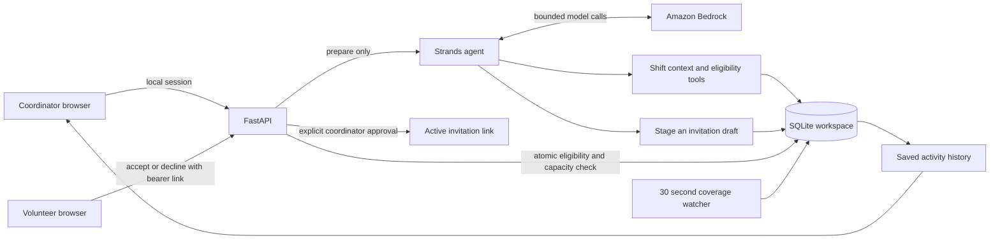
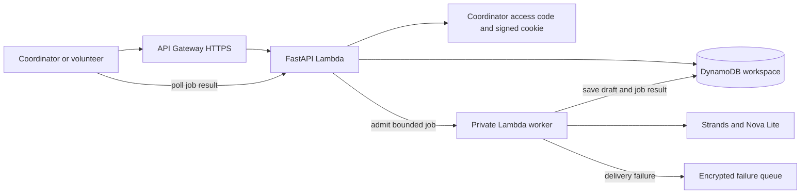

# Kind architecture

## Authority boundaries

The model has no approval, contact, or assignment tool. Tools close over a server-selected shift ID; the model cannot switch organizations or arbitrary shifts. Eligibility constraints are implemented outside the model. The model may stage at most one candidate per run, and the application persists it only after the run returns successfully.

Approval requires a coordinator session and the exact reviewed text. This creates a cryptographically random bearer response link; it does not send a message. The volunteer route exposes only the addressed volunteer's first-party invitation and relevant shift details. It does not return the volunteer directory or roster.

Acceptance uses a SQLite `BEGIN IMMEDIATE` transaction, verifies current availability/qualifications/opt-in and capacity, and closes other invitations when the shift is full. Replaying the same response is idempotent. An invitation cannot be accepted after cancellation, expiration, or another volunteer filling the slot.

The background watcher detects gaps and expires stale invitations; it does not issue paid model calls automatically. The coordinator explicitly starts preparation.

## Local security model

The app binds to loopback, restricts Host and Origin headers, blocks cross-site API requests, uses an HTTP-only SameSite cookie, rejects unauthorized coordinator API access, and suppresses access logs containing invitation links. Bootstrap grants coordinator access only within the local demo model; it is not a production login system. Demo data must not be used as a real operational roster.

## Prepared hosted demo

The cloud store reuses the same eligibility and approval logic. Each mutation reads a strongly consistent document and conditionally writes the next version. A conflicting write returns a refresh message instead of overwriting the newer state. Transactions that made no changes do not write.

Hosted sessions require a random coordinator access code. The server checks its SHA256 digest and signs a cookie with an independent key. Cookies expire after twelve hours, are restricted to HTTPS, and survive Lambda cold starts. Code rotation and signing key rotation revoke access through configuration. This is access control for a shared sample demo, not managed identity or organization isolation for real operations.

Only the API function can queue the private worker. It reserves a persisted daily run allowance and a single active job before dispatch. The worker conditionally claims that job once. Browser requests poll for completion instead of holding an HTTP request through the model loop. Failed jobs are reported explicitly. Normal worker errors are recorded in the job; delivery failures are sent to an encrypted queue. No model call starts from browsing, gap detection, or volunteer responses.

The local coverage watcher runs every thirty seconds. The Lambda deployment scans when an authenticated coordinator loads or polls the workspace; it does not promise a continuously running background timer.

## Deployment work remaining

Before deploying this protected demo: finish template validation, approve resource creation and metered usage, create deployment credentials, upload the package, execute the reviewed stack change, and verify the actual cloud workflow. Before real nonprofit use: add managed identity, organization isolation, operational data entry, backup and recovery procedures, and user validation. External email/SMS delivery needs a selected provider, contact consent handling, and delivery/retry tracking. AgentCore is an optional deployment route, not a dependency of the working local prototype.
