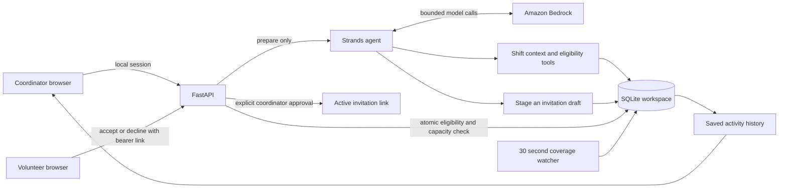

# Kind architecture

## Authority boundaries

The model has no approval, contact, or assignment tool. Tools close over a server-selected shift ID; the model cannot switch organizations or arbitrary shifts. Eligibility constraints are implemented outside the model. The model may stage at most one candidate per run, and the application persists it only after the run returns successfully.

Approval requires a coordinator session and the exact reviewed text. This creates a cryptographically random bearer response link; it does not send a message. The volunteer route exposes only the addressed volunteer's first-party invitation and relevant shift details. It does not return the volunteer directory or roster.

Acceptance uses a SQLite `BEGIN IMMEDIATE` transaction, verifies current availability/qualifications/opt-in and capacity, and closes other invitations when the shift is full. Replaying the same response is idempotent. An invitation cannot be accepted after cancellation, expiration, or another volunteer filling the slot.

The background watcher detects gaps and expires stale invitations; it does not issue paid model calls automatically. The coordinator explicitly starts preparation.

## Local security model

The app binds to loopback, restricts Host and Origin headers, blocks cross-site API requests, uses an HTTP-only SameSite cookie, rejects unauthorized coordinator API access, and suppresses access logs containing invitation links. Bootstrap grants coordinator access only within the local demo model; it is not a production login system. Demo data must not be used as a real operational roster.

## Deployment work remaining

Before public hosting: replace local bootstrap with managed identity, define organization isolation, configure HTTPS and allowed origins, migrate or host durable storage, and deploy a least-privilege backend identity for Bedrock. External email/SMS delivery needs a selected provider, contact consent handling, and delivery/retry tracking. AgentCore is an optional deployment route, not a dependency of the working local prototype.
